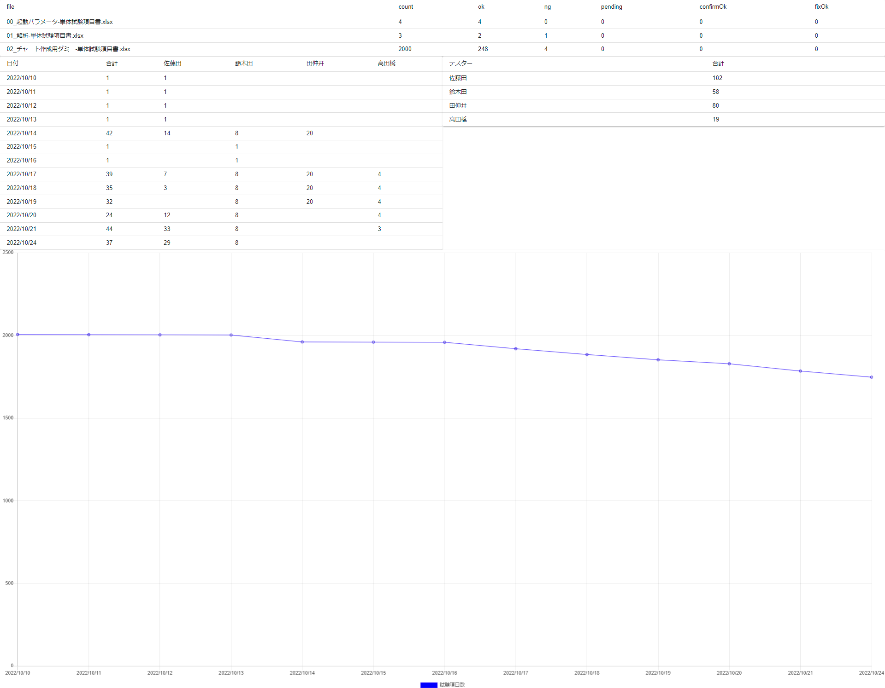

# 試験結果集計ツール2

このプロジェクトは、試験項目書（Excelファイル）を解析し、試験結果・進捗を日別・担当者別に集計・可視化するツールです。複数の解答例が提供されており、それぞれ異なる技術スタックやアプローチで実装されています。

## 機能概要

-   **試験項目書解析:** Excel形式の試験項目書を読み込み、個々のテストケースの結果を抽出します。
-   **集計:** 試験結果を日別、担当者別に集計し、進捗状況を把握できるようにします。
-   **可視化:** 集計結果をWeb UI上でグラフや表として表示し、視覚的に分かりやすくします。

## 解答例

### 1. 集計処理

試験項目書を読み込み、集計処理を行うNode.jsスクリプトです。

-   **`01_解答例_追加仕様_集計_1`**: 基本的な集計処理と、Excel日付の表示用日付への変換を行います。
    -   **技術要素:** Node.js, `xlsx`, `date-format`, `yargs`
    -   **使い方:** `node convert.js -i <入力Excelフォルダ> -o <出力JSONファイル>`
-   **`02_解答例_追加仕様_集計_2`**: (`01`と同様の機能を持つと推測されます。詳細な違いはコード比較が必要です。)

### 2. UI表示

集計されたデータをWeb UIで表示する例です。

-   **`10_解答例_追加仕様_UI_1`**: EJSテンプレートとjQuery DataTable, Chart.jsを用いてHTMLを生成します。
    -   **技術要素:** Node.js, EJS, HTML, CSS, JavaScript, jQuery DataTable, Chart.js
    -   **使い方:** `node create-index.js` を実行し、`index.html`を生成します。
-   **`11_解答例_追加仕様_UI_2`**: (`10`と同様の機能を持つと推測されます。詳細な違いはコード比較が必要です。)
-   **`12_解答例_追加仕様_UI_3`**: ReactとMaterial-UIを用いたダッシュボード形式のUIです。
    -   **技術要素:** React, Material-UI, Chart.js
    -   **使い方:** `npm start` で開発サーバーを起動します。

## 開発環境

-   Node.js
-   （React版はCreate React App環境）

## 関連ドキュメント

-   [課題](./00_docs/%E6%A6%82%E8%A6%81.md)

## スクリーンショット

