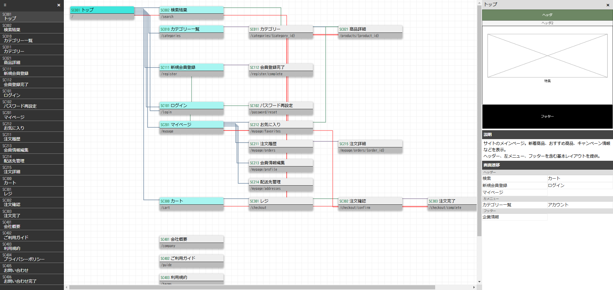

# Markdown から Sitemap 生成ツール

## 概要

仕様書を作成していると仕様書とサイトマップの二重メンテが面倒になることが多い。

Excelからサイトマップを生成するツールは作ったが、結局サイトマップのためにExcelを作らなければならないのは面倒くさい。
マークダウンの仕様書から直接サイトマップが生成できれば作成する仕様書が一冊減るということで作成することにした。



## 前提

```sh
node v18.20.3
```

## 使い方

```sh
cd 11_src

# 初回のみ
npm i

node create-sitemap.js --m {Markdownファイルパス} --o {サイトマップ出力フォルダ}
# 例)
# node create-sitemap.js --m .\samples\sample.md --o out/ECサイト
```

## Markdown 書式

Mardown 文書の一部のタグをページやリンクとして解析しサイトマップを生成する。
解析対象タグは以下の通り。

|記述   |内容   |
|---|---|
|##   |ページ。{ページId},{ページ名},{url},{*階層},{*位置} の形式で指定。 |
||階層,位置は省略可能だが、起点となるページに 0 を一つだけつけること。<br />省略時はリンク構造に従った階層、位置に配置される。|
|### link | リンクを記述する章。<br />ページ内に複数指定可能
|- | リンク章に、{リンク名},{リンク先ページId}をリスト指定

## サンプル

- ECサイト仕様書サンプル
[ECサイト.md](in/ECサイト.md)

- ECサイトサイトマップサンプル


