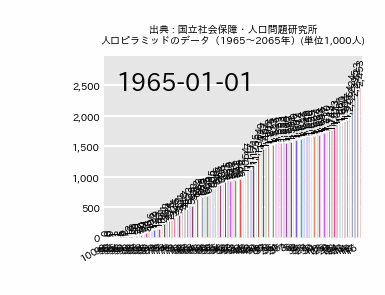

# 労働問題と詐欺グラフ

このプロジェクトは、Pythonと`bar_chart_race`ライブラリを使用して、日本の人口統計データや労働関連データをバーチャートレース形式で可視化するものです。

データの時間的変化を動的に表現することで、労働問題や社会の変化を視覚的に理解することを目的としています。

## 機能

- 国立社会保障・人口問題研究所の人口ピラミッドデータや、労働関連データ（生産年齢人口、完全失業者数、雇用者数など）を読み込みます。
- `bar_chart_race`ライブラリを用いて、これらのデータを時系列で変化する棒グラフアニメーション（バーチャートレース）として生成します。
- 生成されたアニメーションはGIFファイルとして保存されます。

## 使い方

1. **必要なライブラリのインストール**
   ```bash
   pip install pandas bar_chart_race japanize-matplotlib
   ```
   （`japanize-matplotlib`はグラフの日本語表示に必要です。）

2. **データの準備**
   `10_src/data/` ディレクトリに、可視化したいCSVファイルを配置します。
   例: `population.csv` (人口ピラミッドデータ)

3. **スクリプトの実行**
   `10_src/graph.py` を実行します。
   ```bash
   python 10_src/graph.py
   ```

4. **結果の確認**
   生成されたGIFファイルは `10_src/data/` ディレクトリに保存されます。

## 技術要素

- Python
- `pandas` (データ処理)
- `bar_chart_race` (バーチャートレース生成)
- `japanize-matplotlib` (matplotlibの日本語対応)

## 可視化例

- 人口年代別遷移

  

- 生産年齢人口遷移

  

- 完全失業者数遷移

  

- 雇用者数遷移

  

