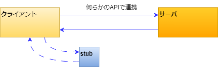

# 共有地の悲劇_API仕様書とスタブ

## 背景

昔で言うところのクラサバ開発、今で言うところの外部API連携開発についてです。

クライアント開発とサーバ（外部API開発）は、制作内容が大きく異なり必要な専門知識や得意分野が異なるため、別の会社で行われることが多いと思います。

ここで、クライアント側はサーバー側へ問い合わせてその応答を受けて処理を継続することが多いと思いますが、サーバー側が存在しなければ開発ができない、だと、困ってしまいます。

そこでサーバーの応答をエミュレートするスタブが必要になります。

参照：wiki: スタブ

> スタブ（stub）とは、コンピュータプログラムのモジュールをテストする際、そのモジュールが呼び出す下位モジュールの代わりに用いる代用品のこと[1]。下位モジュールが未完成でも代わりにスタブを用いることでテストが可能になる。逆に上位モジュールの代わりに用いる代用品をドライバ（ソフトウェアの場合）またはコントローラ（ハードウェアの場合）と呼ぶ。ただし、仮のモジュールではなく正規のモジュールについてもドライバまたはコントローラと呼ばれることがあるので、区別するために「テストドライバ」や「サンプルドライバ」などと呼ぶことも多い。

しかし、**納品物として見ると必要のないもので**、なぜか見積もりに含められず、スタブなしで無理やり開発して、いきなり本物に繋げて疎通確認してそこから頑張るといったケースが散見されます。

また、外部連携のAPIを開発している側は、カジュアルにAPIの仕様を変えたくなることがあります。その様な時にAPIの仕様書の更新や連携が漏れると、クライアント側が動かなくなりますが、それに気づくのは大分時間が経ってからとなります。

この様な問題に長く悩まされてきましたが、もしも、スタブの作成がとても簡単で、API仕様書が自動で生成されたらどうでしょうか？

## 課題

- Python + FastAPI でスタブサーバを作成し、ReDoc で API 仕様書を自動生成してください。
- 作成したスタブサーバは、Thunder Client で試験してください。
- サンプルプロジェクトでは GET メソッドのみしか対応していません。以下追加してください。
  - POST メソッド
  - パスパラメータ
  - File アップロード
  - パラメータ + File アップロード
  - jwtToken 認証

(参考サイト)

- [FastAPI公式](https://fastapi.tiangolo.com/ja/)
- [もういがみ合わない。Thunder Client と FastAPIで10分で作るスタブとAPI仕様書](https://qiita.com/kaku3/items/ef86fd099359b440aa28)
