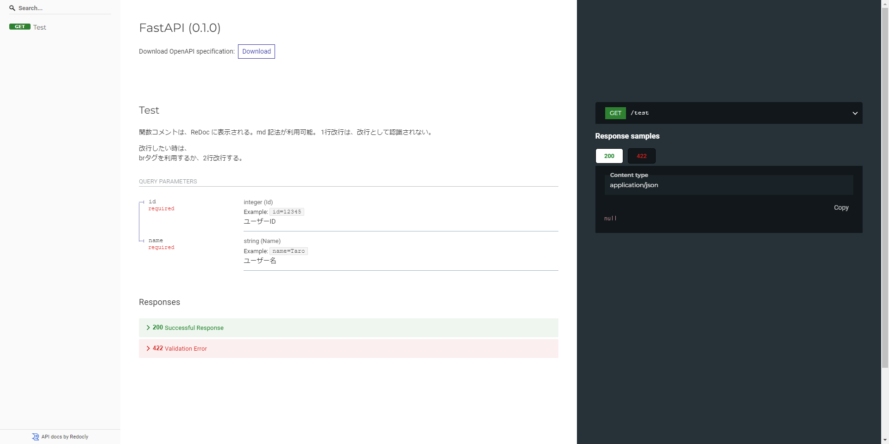
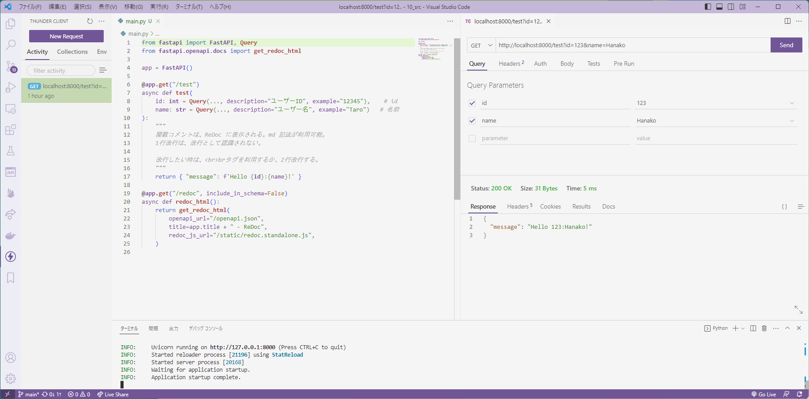

# README

## Python 環境の作成

VS Code でコマンドパレットで 環境の作成を選択。

```cmd
VS Code
Ctrl + Shift + P
Python: 環境の作成
```


## Python ターミナルの作成

```cmd
VS Code
Ctrl + Shift + P
Python: ターミナルを作成する
```


## モジュール追加

```cmd
pip install fastapi
pip install uvicorn
```

## 実行

Pythonターミナルで以下実行。

```cmd
# --reload : ファイル更新時に自動リロード
uvicorn main:app --reload
```

## ReDoc API仕様書



## Thunder Client

