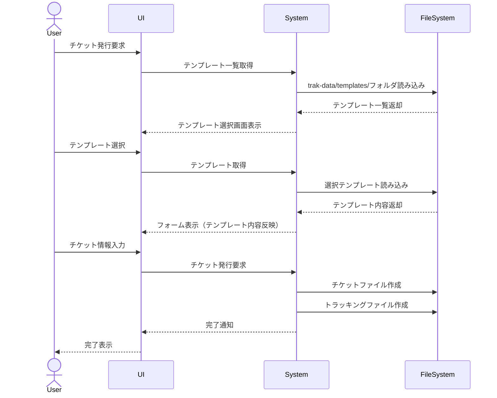
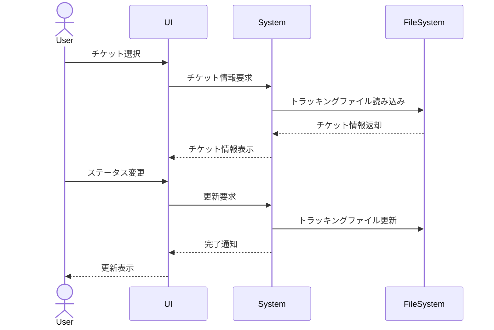

# 機能仕様書

## 1. システム概要

Trakは、VS Code + gitを用いたチケット管理システムです。チケットをAIエージェント(Cline)が処理できるように、データベースではなくファイルシステムでチケットを管理します。

### 1.1 システム前提条件
- VS Code
- Git
- Node.js実行環境

## 2. 機能一覧

### 2.1 認証機能
1. ログイン機能
   - ユーザー名とパスワードによる認証
   - セッション管理

2. ログアウト機能
   - セッション破棄

### 2.2 チケット管理機能
1. チケット発行機能
   - テンプレートベースのチケット作成
   - 連番採番（フォルダ内最大番号 + 1）
   - チケット情報の設定
     - タイトル
     - 担当者（複数可）
     - 期限
     - 見積もり
     - ステータス

2. チケット編集機能
   - システムからの編集
   - エディタでの直接編集
   - チケット情報の更新

3. ステータス変更機能
   - チケットステータスの変更
   - 担当者の変更

### 2.3 閲覧機能
1. ガントチャートビュー
   - チケットのタイムライン表示
   - ドラッグ＆ドロップによる期間調整

2. テーブルビュー
   - リスト形式での表示
   - カラムのソート機能
   - フィルタリング機能

3. 検索機能
   - キーワード検索
   - 条件指定検索
     - ステータス
     - 担当者
     - 期間

### 2.4 設定管理機能
1. ユーザー管理
   - ユーザーの追加・編集・削除
   - 権限設定

2. チケットステータス管理
   - ステータスの追加・編集・削除
   - ステータスフロー設定

3. テンプレート管理
   - チケットテンプレートの追加・編集・削除

## 3. 処理フロー

### 3.1 チケット発行フロー

### 3.2 ステータス変更フロー

## 4. 外部インターフェース

### 4.1 VS Code連携
- VS Code上での直接ファイル編集
- Git操作との連携

### 4.2 ファイルシステム連携
- チケットファイル（trak-data/tickets/内のMarkdown）の読み書き
- トラッキングファイル（trak-data/trackings/内のJSON）の読み書き
- 設定ファイル（trak-data/configs/内のJSON）の読み書き
- テンプレートファイル（trak-data/templates/内のMarkdown）の読み書き

## 5. セキュリティ要件

### 5.1 認証・認可
- ユーザー認証必須
- 権限に基づくアクセス制御

### 5.2 データ保護
- ファイルアクセス制御
- セッション管理
