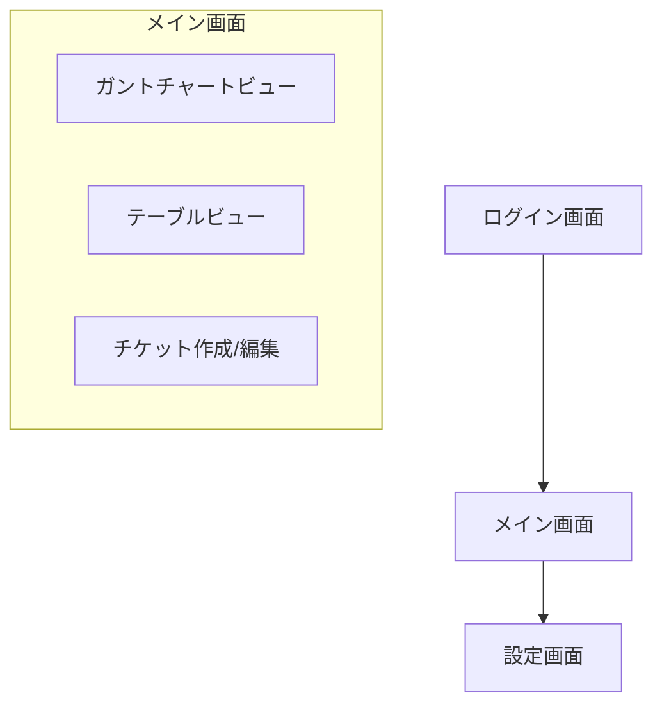
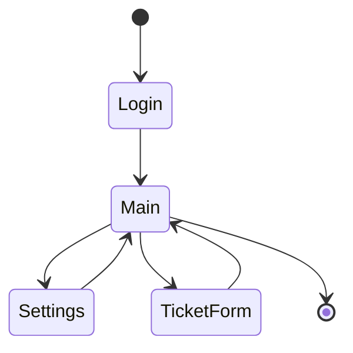

# 画面仕様書

## 1. 画面構成

### 1.1 画面一覧

## 2. 画面詳細

### 2.1 ログイン画面
#### 機能概要
- ユーザー認証を行う
- 認証成功時にメイン画面へ遷移

#### 画面項目
| 項目 | 種類 | 必須 | 説明 |
|------|------|------|------|
| ユーザー名 | テキスト入力 | ○ | ログインユーザー名 |
| パスワード | パスワード入力 | ○ | ログインパスワード |
| ログインボタン | ボタン | - | 認証実行 |

### 2.2 メイン画面
#### 機能概要
- チケットの閲覧・管理を行う
- 複数のビュー形式を切り替え可能

#### 画面項目
| 項目 | 種類 | 説明 |
|------|------|------|
| ビュー切替タブ | タブ | ガントチャート/テーブルの切り替え |
| 検索バー | テキスト入力 | キーワード検索 |
| フィルター | ドロップダウン | ステータス、担当者等での絞り込み |
| 新規チケットボタン | ボタン | チケット作成フォームを開く |
| チケット一覧 | リスト/ガントチャート | チケットの一覧表示 |

#### ガントチャートビュー固有の項目
| 項目 | 種類 | 説明 |
|------|------|------|
| タイムライン | ガントチャート | チケットの期間表示 |
| スケール切替 | ボタングループ | 日/週/月表示の切り替え |

#### テーブルビュー固有の項目
| 項目 | 種類 | 説明 |
|------|------|------|
| ソートヘッダー | クリッカブルヘッダー | カラムごとのソート |
| 表示カラム設定 | ドロップダウン | 表示カラムの選択 |

### 2.3 チケット作成/編集画面
#### 機能概要
- 新規チケットの作成
- 既存チケットの編集

#### 画面項目
| 項目 | 種類 | 必須 | 説明 |
|------|------|------|------|
| テンプレート | ドロップダウン | ○ | チケットテンプレートの選択 |
| タイトル | テキスト入力 | ○ | チケットタイトル |
| 担当者 | 複数選択 | ○ | 担当ユーザーの選択 |
| ステータス | ドロップダウン | ○ | チケットステータス |
| 期限 | 日付選択 | - | チケット期限 |
| 見積もり | 数値入力 | - | 工数見積もり |
| 内容 | マークダウンエディタ | ○ | チケット詳細内容 |
| 保存ボタン | ボタン | - | チケットの保存 |
| キャンセルボタン | ボタン | - | 編集のキャンセル |

### 2.4 設定画面
#### 機能概要
- システム設定の管理
- マスターデータの管理

#### 画面項目
| 項目 | 種類 | 説明 |
|------|------|------|
| 設定カテゴリ | タブ | ユーザー/ステータス/テンプレート |
| 設定一覧 | テーブル | 設定項目の一覧 |
| 追加ボタン | ボタン | 新規設定の追加 |
| 編集ボタン | ボタン | 設定の編集 |
| 削除ボタン | ボタン | 設定の削除 |

## 3. 画面遷移

## 4. レイアウト仕様

### 4.1 共通レイアウト
- ヘッダー
  - ロゴ
  - ユーザーメニュー
  - 設定へのリンク
- メインコンテンツ
- フッター

### 4.2 レスポンシブ対応
- ブレイクポイント
  - デスクトップ: 1024px以上
  - タブレット: 768px-1023px
  - モバイル: 767px以下
- モバイル表示時
  - メニューのハンバーガー化
  - テーブルの横スクロール対応
  - ガントチャートの最適化表示
