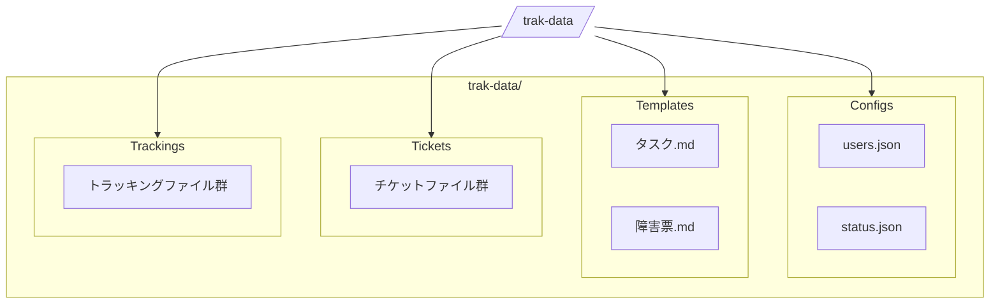

# データ・設定ファイル仕様書

## 1. ファイル構成



## 2. チケットファイル仕様

### 2.1 保存場所
- trak-data/tickets/フォルダに保存

### 2.2 ファイル命名規則
- 形式: `{4桁連番}_{タイトル}.md`
- 例: `0001_システム設計.md`

### 2.3 ファイル構造
```markdown
# [チケットタイトル]

## 概要
[チケット概要]

## 詳細
[チケット詳細]

## 参考情報
- [参考リンクや関連情報]
```

## 3. トラッキングファイル仕様

### 3.1 保存場所
- trak-data/trackings/フォルダに保存

### 3.2 ファイル命名規則
- 形式: `{4桁連番}.json`
- 例: `0001.json`

### 3.3 JSONスキーマ
```json
{
  "type": "object",
  "properties": {
    "id": {
      "type": "string",
      "pattern": "^\\d{4}$",
      "description": "チケット番号（4桁）"
    },
    "title": {
      "type": "string",
      "description": "チケットタイトル"
    },
    "assignees": {
      "type": "array",
      "items": {
        "type": "string"
      },
      "description": "担当者リスト"
    },
    "createdAt": {
      "type": "string",
      "format": "date-time",
      "description": "起票日"
    },
    "dueDate": {
      "type": "string",
      "format": "date",
      "description": "締め切り"
    },
    "estimate": {
      "type": "number",
      "description": "見積もり工数（時間）"
    },
    "status": {
      "type": "string",
      "description": "チケットステータス"
    }
  },
  "required": ["id", "title", "assignees", "createdAt", "status"]
}
```

### 3.4 サンプルデータ
```json
{
  "id": "0001",
  "title": "システム設計",
  "assignees": ["user1", "user2"],
  "createdAt": "2025-03-20T09:00:00+09:00",
  "dueDate": "2025-04-20",
  "estimate": 40,
  "status": "進行中"
}
```

## 4. 設定ファイル仕様

### 4.1 ユーザー設定（trak-data/configs/users.json）
```json
{
  "type": "object",
  "properties": {
    "users": {
      "type": "array",
      "items": {
        "type": "object",
        "properties": {
          "id": {
            "type": "string",
            "description": "ユーザーID"
          },
          "name": {
            "type": "string",
            "description": "表示名"
          },
          "email": {
            "type": "string",
            "format": "email",
            "description": "メールアドレス"
          },
          "role": {
            "type": "string",
            "enum": ["admin", "user"],
            "description": "ユーザー権限"
          }
        },
        "required": ["id", "name", "email", "role"]
      }
    }
  }
}
```

### 4.2 ステータス設定（trak-data/configs/status.json）
```json
{
  "type": "object",
  "properties": {
    "statuses": {
      "type": "array",
      "items": {
        "type": "object",
        "properties": {
          "id": {
            "type": "string",
            "description": "ステータスID"
          },
          "name": {
            "type": "string",
            "description": "表示名"
          },
          "color": {
            "type": "string",
            "pattern": "^#[0-9a-fA-F]{6}$",
            "description": "表示色（16進数カラーコード）"
          },
          "order": {
            "type": "integer",
            "description": "表示順"
          }
        },
        "required": ["id", "name", "color", "order"]
      }
    },
    "transitions": {
      "type": "array",
      "items": {
        "type": "object",
        "properties": {
          "from": {
            "type": "string",
            "description": "遷移元ステータスID"
          },
          "to": {
            "type": "string",
            "description": "遷移先ステータスID"
          }
        },
        "required": ["from", "to"]
      },
      "description": "ステータス遷移定義"
    }
  }
}
```

### 4.3 テンプレートファイル
- 格納場所: trak-data/templates/フォルダ
- 形式: Markdown
- ファイル命名規則: テンプレート種別を表す名前（例: `タスク.md`, `障害票.md`）

#### テンプレートファイル構造例
```markdown
# [チケットタイトル]

## 概要
[概要を記載してください]

## 詳細
[詳細な内容を記載してください]

## 参考情報
- [参考リンクや関連情報があれば記載してください]
```

テンプレートファイルは、チケット作成時に選択可能で、選択されたテンプレートの内容がチケット作成フォームに自動的に読み込まれます。

## 5. データ保存規則

### 5.1 文字コード
- UTF-8（BOMなし）

### 5.2 改行コード
- LF（\n）

### 5.3 インデント
- 半角スペース2文字

### 5.4 日時形式
- 日時: ISO 8601形式（例: "2025-03-20T09:00:00+09:00"）
- 日付のみ: YYYY-MM-DD形式（例: "2025-03-20"）

### 5.5 命名規則
- ファイル名: キャメルケース（例: `myTemplate.json`）
- JSON内のキー: キャメルケース（例: `createdAt`）
- ID・コード値: 半角英数字とハイフン（例: `user-001`）
