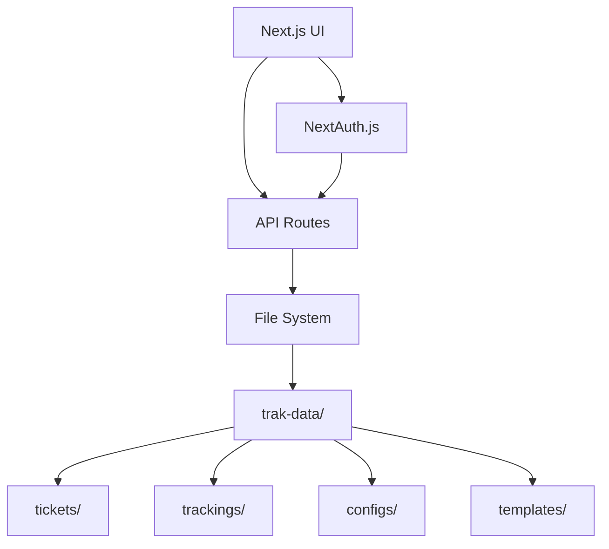
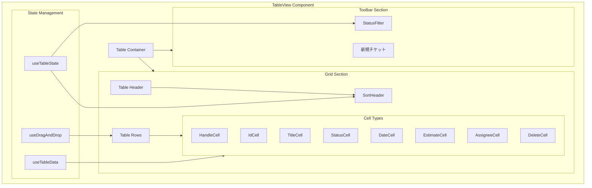
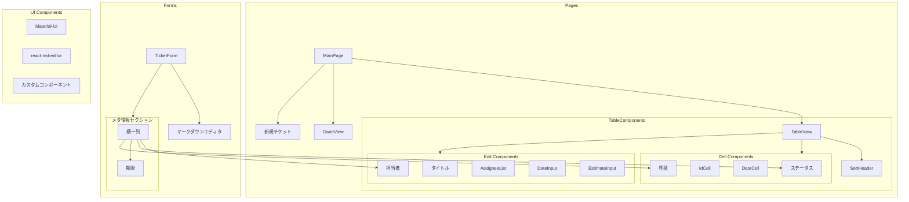
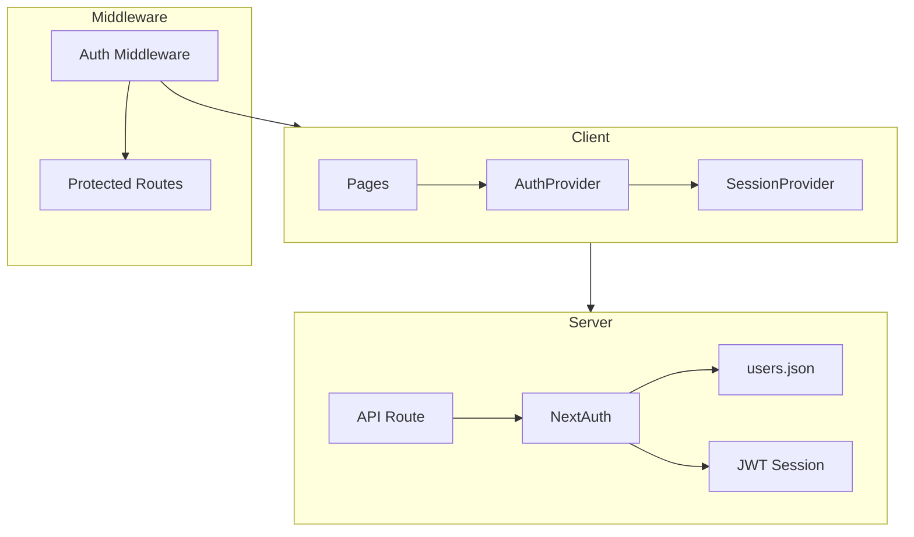

# システムパターン

## アーキテクチャ概要

## テーブルビュー構造

## カラム定義

- 固定カラム:
  - handle: ドラッグハンドル
  - id: チケットID
  - title: タイトル
  - status: ステータス
  - startDate: 開始日
  - dueDate: 期限
  - estimate: 見積
  - assignee: 担当者
  - delete: 削除アクション

## 状態管理

1. テーブル状態（useTableState）
   - ソートカラム
   - ソート方向
   - フィルタ状態（選択されたステータス）
   - 編集中のセル

2. ドラッグ&ドロップ（useDragAndDrop）
   - アクティブなドラッグアイテム
   - ドラッグ開始処理
   - ドラッグ終了処理
   - 順序の正規化

3. データ管理
   - チケットデータ
   - ユーザー情報
   - ステータス定義
   - ソート順序

## コンポーネント構造

## 認証アーキテクチャ

## ファイルシステム設計

### データ管理（trak-data/）
すべてのデータを一元管理するルートフォルダ

1. チケットファイル（trak-data/tickets/）
   - 形式: マークダウン
   - 命名規則: `{4桁連番}_{タイトル}.md`
   - 内容: チケットの詳細情報

2. トラッキング情報（trak-data/trackings/）
   - 形式: JSON
   - 命名規則: `{4桁連番}.json`
   - 保持情報:
     - 担当者（複数可）
     - 起票日
     - 締め切り
     - 見積
     - ステータス

3. 設定管理（trak-data/configs/）
   - ユーザー管理（users.json）
     - ユーザーID
     - 名前
     - メールアドレス
     - ロール（admin/user）
   - ステータス定義（statuses.json）
     - ID
     - 名前
     - 説明
   - テンプレート管理（templates/）
     - タスクテンプレート
     - 障害票テンプレート

## 主要なデザインパターン

1. コンポーネントパターン
   - Atomic Design
     - Atoms: 基本入力要素
     - Molecules: フォームグループ
     - Organisms: フォーム全体
   - Container/Presentational
     - ロジック分離
     - UI再利用性向上

2. フォーム管理パターン
   - Controlled Components
   - バリデーション分離
   - エラーハンドリング集約

3. データフローパターン
   - 単方向データフロー
   - イミュータブルな状態管理
   - APIデータの適切なキャッシュ

4. レスポンシブパターン
   - モバイルファースト
   - フレックスボックスレイアウト
   - ブレークポイント管理

## UI/UXパターン

1. フォームデザイン
   - インライン検証
   - リアルタイムフィードバック
   - プログレッシブ拡張

2. テーブル編集パターン
   - セル単位の編集モード
   - クリックアウトによる編集終了
   - ドロップダウンの適切な配置
     - z-indexの階層管理（100: 編集セル, 101: ドロップダウン）
     - セルからのオーバーフロー制御
     - 編集モードのレイヤリング

3. URL直接アクセスパターン
   - 状態に基づく適切なリダイレクト
   - エディタの自動展開
   - 履歴管理との連携

2. インタラクション
   - インクリメンタルサーチ
   - ドラッグ＆ドロップ
   - ショートカットキー

3. エラー処理
   - エラーバウンダリ
   - フォールバックUI
   - グレースフルデグラデーション

## データ永続化パターン

1. ファイルベース
   - マークダウン（チケット本文）
   - JSON（メタデータ）
   - 設定ファイル

2. キャッシュ戦略
   - ブラウザキャッシュ
   - APIレスポンスキャッシュ
   - オートセーブ

3. 同期管理
   - 楽観的ロック
   - 競合解決
   - 差分マージ
