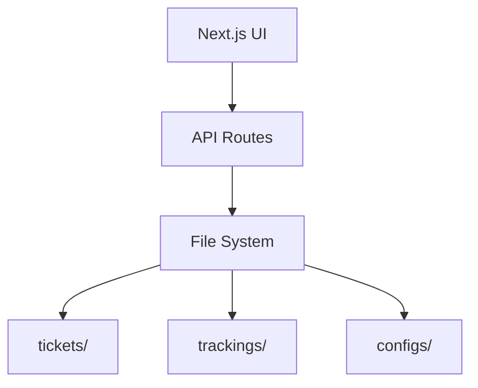

# システムパターン

## アーキテクチャ概要

## ファイルシステム設計

### チケット管理
1. チケットファイル（tickets/）
   - 形式: マークダウン
   - 命名規則: `{4桁連番}_{タイトル}.md`
   - 内容: チケットの詳細情報

2. トラッキング情報（trackings/）
   - 形式: JSON
   - 命名規則: `{4桁連番}.json`
   - 保持情報:
     - 担当者（複数可）
     - 起票日
     - 締め切り
     - 見積もり
     - ステータス

### 設定管理（configs/）
- ユーザー管理
- チケットステータス定義
- チケットテンプレート

## 主要なデザインパターン

1. ファイルベースのデータストア
   - Git統合による変更追跡
   - AIエージェントとの連携容易性

2. マークダウン/JSONの分離
   - 人間可読性（マークダウン）
   - システム処理（JSON）の両立

3. テンプレートベースの標準化
   - チケット作成の一貫性確保
   - 必要情報の漏れ防止

## コンポーネント関係

1. フロントエンド（Next.js）
   - ユーザー認証
   - チケット管理UI
   - 複数ビュー実装
     - ガントチャート
     - テーブル
     - 検索/ソート

2. ファイルシステム連携
   - チケットCRUD操作
   - トラッキング情報同期
   - 設定情報管理
