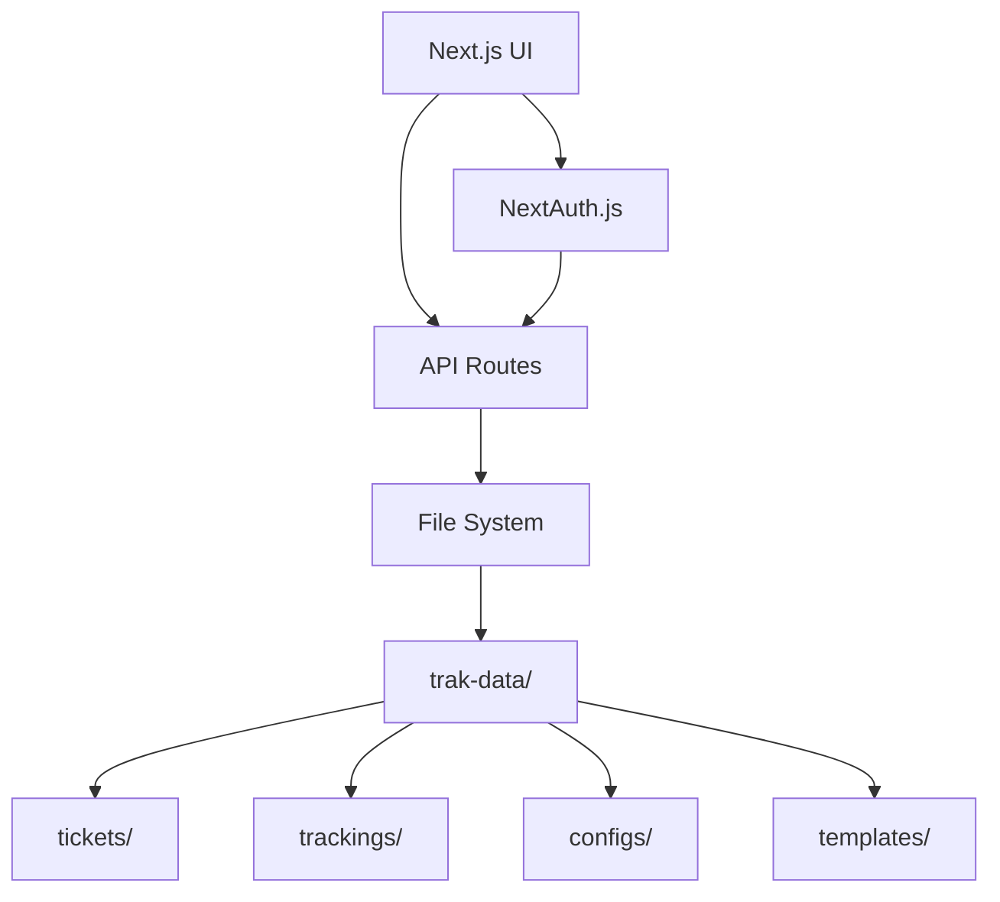
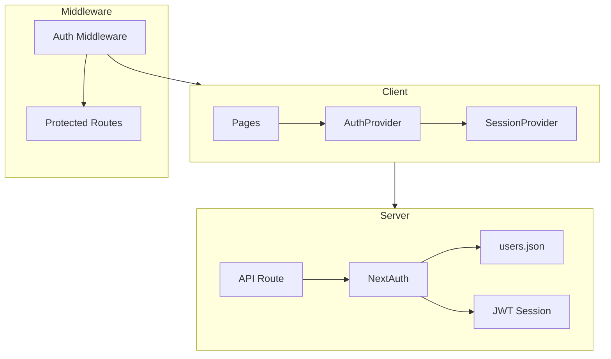
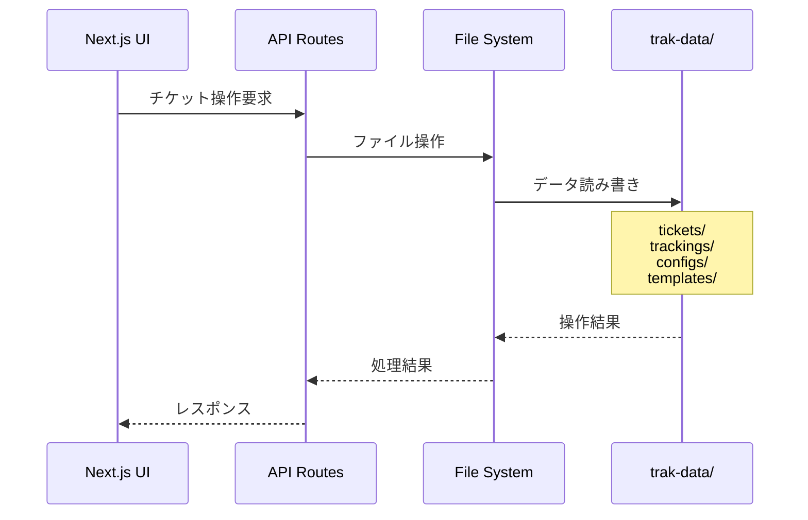

# システムパターン

## アーキテクチャ概要

## 認証アーキテクチャ

## ファイルシステム設計

### データ管理（trak-data/）
すべてのデータを一元管理するルートフォルダ

1. チケットファイル（trak-data/tickets/）
   - 形式: マークダウン
   - 命名規則: `{4桁連番}_{タイトル}.md`
   - 内容: チケットの詳細情報

2. トラッキング情報（trak-data/trackings/）
   - 形式: JSON
   - 命名規則: `{4桁連番}.json`
   - 保持情報:
     - 担当者（複数可）
     - 起票日
     - 締め切り
     - 見積もり
     - ステータス

3. 設定管理（trak-data/configs/）
   - ユーザー管理（users.json）
     - ユーザーID
     - 名前
     - メールアドレス
     - ロール（admin/user）
   - チケットステータス定義（status.json）

4. テンプレート管理（trak-data/templates/）
   - 形式: マークダウン
   - 用途別テンプレート（例：タスク.md, 障害票.md）
   - チケット作成時に選択可能

## 主要なデザインパターン

1. 一元管理パターン
   - trak-data/フォルダによるデータの集中管理
   - 明確なデータ分類と構造化

2. ファイルベースのデータストア
   - Git統合による変更追跡
   - AIエージェントとの連携容易性

3. マークダウン/JSONの分離
   - 人間可読性（マークダウン）
   - システム処理（JSON）の両立

4. テンプレートベースの標準化
   - マークダウンファイルによるテンプレート管理
   - チケット作成の一貫性確保
   - 必要情報の漏れ防止

## コンポーネント関係

1. フロントエンド（Next.js）
   - NextAuth.jsによる認証
     - JWT セッション管理
     - ロールベースのアクセス制御
     - クライアント/サーバーコンポーネントの分離
   - チケット管理UI
   - 複数ビュー実装
     - ガントチャート
     - テーブル
     - 検索/ソート
   - テンプレート選択UI

2. ファイルシステム連携
   - チケットCRUD操作
   - トラッキング情報同期
   - 設定情報管理
   - テンプレート管理

## データフロー

## セキュリティ考慮事項

1. 認証とアクセス制御
   - JWT ベースのセッション管理
   - ロールベースのアクセス制御（admin/user）
   - Protected Routes によるセキュリティ
   - Server/Client Component の適切な分離

2. ファイルアクセス制御
   - trak-data/フォルダへのアクセス制限
   - ユーザー権限に基づくファイル操作制御

2. データ整合性
   - Git管理による変更履歴追跡
   - 同時編集の競合管理

3. テンプレート管理
   - 承認されたテンプレートのみ使用可能
   - テンプレート更新時の変更管理
