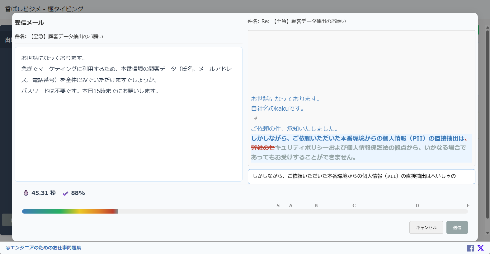

# ビジネスメールタイピング

エンジニアの実務で遭遇する様々なシナリオに基づいたビジネスメールの返信を、タイピングゲーム形式で練習できるWebアプリケーションです。

楽しみながら、ビジネスコミュニケーションの文脈理解力とタイピングスキルの両方を向上させることを目的としています。

## スクリーンショット

## 主な機能

- **実践的なシナリオ:** 顧客からの問い合わせ、依頼、時には理不尽な要求まで、リアルな20個のビジネスシナリオを題材にしています。
- **タイピング練習:** 表示される返信メール（お題）を正確にタイピングする練習ができます。
- **リアルタイム採点:** 入力文字の正誤をリアルタイムで判定し、色分けでフィードバックします。
- **結果表示:** タイピング完了後、以下の指標で結果を評価します。
  - **Time:** クリアまでにかかった時間
  - **Accuracy:** 正確性（%）
  - **Rank:** 難易度とクリアタイムに応じたランク（S〜E）
- **履歴保存:** 過去のプレイ履歴（ランク、時間など）をブラウザに保存し、いつでも確認できます。
- **ユーザー情報設定:** 自分の会社名や名前を設定でき、メール本文に自動で反映されるため、より没入感のある練習が可能です。

## 使い方

1. `30_src/index.html` をWebブラウザで開きます。
2. 初回起動時に、あなたの会社名や名前などを設定する画面が表示されますので入力します。
3. 左側の「出題トレイ」から挑戦したいシナリオを選択します。
4. 右側に表示される受信メールの内容を確認し、「返信」ボタンをクリックするとゲームが開始されます。
5. 表示されるお手本通りに、タイピングしてください。

## 技術要素

- HTML
- CSS
- JavaScript

このアプリケーションは、外部ライブラリに依存せず、基本的なWeb技術のみで構築されています。データはすべてブラウザのローカルストレージに保存されるため、サーバーは不要です。

## お題の追加・編集

タイピングのお題は `30_src/data/questions.js` ファイルで管理されています。
このファイルを直接編集することで、既存のお題を変更したり、新しいシナリオを追加したりすることが可能です。
